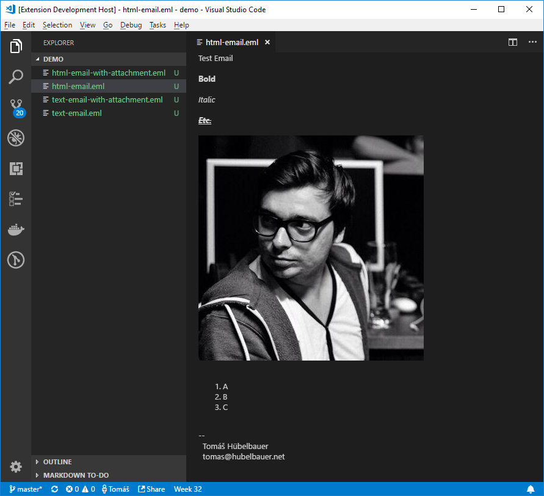

# [Email Viewer](https://marketplace.visualstudio.com/items?itemName=TomasHubelbauer.email-viewer)

VS Code Email Viewer allows you to preview EML and MSG files in a VS Code web
view (virtual document) as well as mounts EML and MSG file as virtual workspace
directories giving you the option of browsing the email attachments.

## Usage

Click and EML or a MSG file and wait for the email preview to open. At the same
time, a new workspace directory will be added - it is a virtual file system which
allows you to browse the email content and attachments.

To reopen the preview after you've closed it, just reopen the EML/MSG again. To
close the virtual file system with email content and attachments, remove it from
the workspace.

## Changelog

See the [changelog](CHANGELOG.md).

## To-Do

### Add an option of using the custom editor API instead of the webview API

Perhaps the custom editor API (a read only editor) is a better fit than the web
view API, but consider that this will block the user's option to show the actual
email file content then, so for that reason maybe the extension should support
both and make that configurable.

### Make opening the email as a virtual folder in the workspace a config option

### Figure out why the file system provider displays the yellow warning the 1st time

It only seems to happen the first time an email is opened, not the subsequent
times.

### Fix attachment links in the email preview not working

Perhaps the webview needs to be allowed some security stuff for them to work or
maybe webview messaging needs to be used and the file open request handled in
the extension code.

### Add a MSG file test case

### Add tests

### Consider rendering MSG file content as MarkDown HTML

The body text seems to be raw and only processed for display by Outlook (?) so we can try to render it as MarkDown to make it look at least somewhat nice.

If this is wrong and we get HTML it will just stay HTML after the MarkDown pass so this isn't risky.
